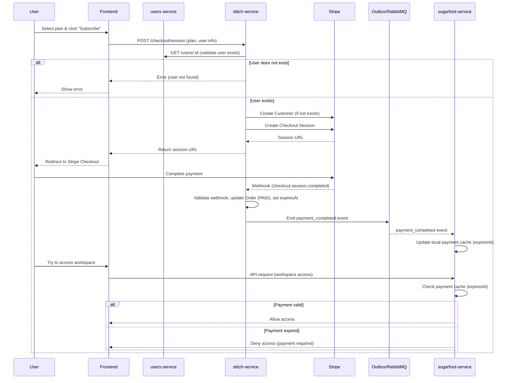

<div align='center'>
  


He is angry 😠 because it doesn't look him at all.

</div>

<br/>

[Stitch](https://upload.wikimedia.org/wikipedia/en/thumb/d/d2/Stitch_%28Lilo_%26_Stitch%29.svg/1200px-Stitch_%28Lilo_%26_Stitch%29.svg.png) is a Node.js microservice for checkout and payment, built for the FUBS monorepo. It integrates with Stripe to manage payment sessions, webhooks, and order status, and is designed for robust, event-driven microservice architectures.

---

## 🧭 Payment & Workspace Access Flows

### 1. New User (No Workspace)

1. User chooses a plan.
2. User pays via checkout (Stripe).
3. On successful payment, user gains access and can create a workspace.
4. User must re-pay monthly to maintain access.

### 2. Existing User With Workspace, Missed Payment

1. User does not re-pay for the next cycle.
2. User loses access to all their workspaces (cascade: also loses access to all projects, tasks, etc. within those workspaces) until payment is made again.
   - All workspace memberships (Owner, Admin, Member) are suspended for the user.
   - This ensures no access to any workspace data or related resources until re-payment.

### 3. Existing User With Workspace, Re-Pays

1. User re-pays for the next cycle.
2. User regains access to their workspace.

---

## 🖼️ Service & Payment Flow Diagram

```
	+-------------------+         +-------------------+         +-------------------+
	|    User (Owner)   |         |   stitch-service  |         |  sugarfoot-service|
	+-------------------+         +-------------------+         +-------------------+
					 |                             |                              |
					 | 1. Choose plan & pay ------>|                              |
					 |                             |                              |
					 |<--- Stripe Checkout --------|                              |
					 |                             |                              |
					 |--- Payment Success Webhook->|                              |
					 |                             |                              |
					 |                             |--- Emit payment event ------> |
					 |                             |   (e.g., payment_completed)  |
					 |                             |   (RabbitMQ/outbox)          |
					 |                             |                              |
					 |                             |                              |
					 |         2. User (any role) tries to access workspace       |
					 |---------------------------------------------------------->|
					 |                             |                              |
					 |                             |--- Receives payment event ---|
					 |                             |   (RabbitMQ/outbox)          |
					 |                             |   → Updates local payment cache|
					 |                             |                              |
					 |                             |--- Allow/Deny access ------- |
					 |                             |   (checks expiresAt in cache) |
					 |                             |                              |
```

**Legend:**

- All workspace access checks in `sugarfoot-service` depend on the owner’s payment status, which is cached locally and updated by payment events from `stitch-service`.
- Payment events and webhooks are handled in `stitch-service` and propagated via RabbitMQ/outbox.
- If the owner is unpaid (i.e., `expiresAt` in the cache is in the past), all users (owner, admin, member) are denied access to the workspace and its resources.
- This enables eventual consistency and decouples the services for better scalability and reliability.

## 🔄 Full Access Flow: Checkout to Workspace Access



## 🏗️ Architecture & Responsibilities

- **Checkout Sessions**: Create, update, and manage Stripe checkout/payment sessions.
- **Webhooks**: Securely receive and process Stripe webhook events (payment succeeded, failed, refunds, etc).
- **Order Management**: Track order/payment status, persist transaction metadata.
- **Idempotency**: Ensure all payment and webhook operations are idempotent.
- **Security**: Validate all incoming requests (JWT for internal, Stripe signatures for webhooks).
- **Event-Driven**: Emit events (e.g., payment_completed) to other services via outbox pattern or message broker.

## API Design

- `POST /checkout/session`: Initiate a Stripe checkout session.
- `GET /checkout/session/:id`: Retrieve session/payment status.
- `POST /webhook/stripe`: Stripe webhook endpoint (secured, idempotent).
- OpenAPI/Swagger documented.

## Database Schema (Prisma)

```prisma
// The ownerId in Order always refers to the workspace owner (payer).
model Order {
	id                  String   @id @default(uuid())
	ownerId             String
	planType            PlanType // Defines allowed workspaces, features, etc.
	amount              Decimal
	currency            String
	status              OrderStatus @default(PENDING)
	stripeSessionId     String?
	stripePaymentIntentId String?
	createdAt           DateTime @default(now())
	updatedAt           DateTime @updatedAt
  expiresAt           DateTime
}

## Stripe Integration
enum PlanType {
	FREE
	SOLO
	ENTERPRISE
}


model Outbox {
	id          String   @id @default(uuid())
	type        String
	payload     String
	processed   Boolean  @default(false)
	createdAt   DateTime @default(now())
	processedAt DateTime?
}

model WebhookEvent {
	id        String   @id @default(uuid())
	type      String
	payload   String
	processed Boolean  @default(false)
	receivedAt DateTime @default(now())
}

enum OrderStatus {
	PENDING
	PAID
	FAILED
	CANCELLED
	EXPIRED
}
```

// PlanType enum can be used to define workspace limits in your business logic, e.g.:
// FREE = 1 workspace, SOLO = 3 workspace, ENTERPRISE = unlimited

## Plan Interface (for Stripe Integration)

```ts
// Used for business logic and Stripe product/price mapping
export interface Plan {
  type: 'FREE' | 'SOLO' | 'ENTERPRISE';
  name: string; // Display name
  description: string;
  priceCents: number; // Price in cents (e.g., 990 = $9.90)
  stripePriceId: string; // Stripe Price ID for this plan
  workspaceLimit: number | null; // null = unlimited
  features: string[];
  billingPeriod: 'month' | 'year';
}

// Example:
  {
    type: 'SOLO',
    name: 'Solo',
    description: 'Up to 3 workspaces',
    priceCents: 990,
    stripePriceId: 'price_1...',
    workspaceLimit: 3,
    features: ['3 workspaces', 'Basic support'],
    billingPeriod: 'month'
  }
```

- Uses Stripe SDK for Node.js.
- Stripe secret keys in environment variables.
- Stripe’s idempotency keys for all API calls.
- Webhook signatures validated using Stripe’s signing secret.

## 📁 Project Structure

```
apps/
	stitch/
		src/
			app/
				app.module.ts
				app.controller.ts
				app.service.ts
					checkout/
						checkout.module.ts
						checkout.controller.ts
						checkout.service.ts
						dto/
							create-checkout-session.dto.ts
					webhook/
						webhook.module.ts
						webhook.controller.ts
						webhook.service.ts
					orders/
						orders.module.ts
						orders.service.ts
						orders.repository.ts
						orders.entity.ts
					plans/
						plans.module.ts
						plans.service.ts
						plans.config.ts         # Plan definitions (see Plan interface)
					outbox/
						outbox.module.ts
						outbox.service.ts
						outbox.repository.ts
						outbox.entity.ts
			common/
				prisma.service.ts
				exceptions/
				guards/
				utils/
			main.ts
		prisma/
			schema.prisma
			migrations/
		README.md
		.env.example
		Dockerfile
		project.json
		webpack.config.js
```

## 🧩 StripeService Responsibilities & Stripe Resource Checklist

### StripeService Responsibilities

- Initialize and configure the Stripe SDK (using environment/config values)
- Centralize all Stripe API calls for:
  - Creating and managing checkout sessions
  - Creating and managing Stripe customers (if needed)
  - Creating and managing Stripe products and prices (for plans)
  - Retrieving and validating Stripe events (webhooks)
  - Validating webhook signatures
  - Handling refunds, cancellations, and payment status checks
  - Mapping business logic (plans, orders) to Stripe resources
- Expose helper methods for:
  - Creating products/prices for new plans
  - Looking up Stripe price IDs for plans
  - Fetching payment/session status
  - Handling idempotency keys
  - (Optional) Managing subscriptions if you move to recurring billing
- Provide a single point of integration for all modules (checkout, orders, webhook, etc.)

### Stripe Resources Required

To use this service, you will need to create and manage the following resources in your Stripe account:

- **Products**: One for each plan (e.g., Free, Solo, Enterprise)
- **Prices**: One for each product/plan and billing period (e.g., monthly, yearly)
  - Each price should match your `Plan` config (amount, currency, interval)
- **Webhook Endpoint**: For receiving payment events (e.g., payment_intent.succeeded, checkout.session.completed)
- **API Keys**: Secret and publishable keys for your environment
- **Webhook Signing Secret**: For validating incoming Stripe webhooks
- (Optional) **Customers**: If you want to track users in Stripe
- (Optional) **Subscriptions**: If you want to support recurring billing (vs. one-time checkout)

**Tip:**
Document the mapping between your local plan config and Stripe product/price IDs. Automate creation of products/prices via StripeService if possible, or keep them in sync manually.

**Notes:**

- Each domain (checkout, webhook, orders, plans, outbox) is a folder/module.
- `plans.config.ts` holds the plan definitions and Stripe price IDs.
- `outbox/` handles outbox pattern and RabbitMQ integration.
- `common/` for shared services, guards, and utilities.
- Prisma schema and migrations are in `prisma/`.
- Top-level files for Docker, Nx, and documentation.

## 🚀 Implementation Strategy: Step-by-Step

Follow this plan to implement the Stitch service, based on the architecture and requirements above. Assumes the Nx NestJS app is already scaffolded.

### 1. Scaffold Data Models (Prisma)

- Define `Order`, `Outbox`, and `WebhookEvent` models in `prisma/schema.prisma`.
- Run `npx prisma migrate dev` to generate migrations and sync the database.
- Generate Prisma client and validate models.

### 2. Set Up Project Structure

- Create folders and files as per the recommended structure (see above).
- Add `.module.ts` files for each domain (checkout, webhook, orders, plans, outbox).
- Add DTOs for input validation.

### 3. Implement Plan Config & Business Logic

- Create `plans/plans.config.ts` with all plan definitions (see Plan interface).
- Implement `plans.service.ts` to expose plan data to the rest of the app.

### 4. Implement Order Management

- Implement `orders.service.ts`, `orders.repository.ts`, and `orders.entity.ts` for CRUD and business logic.
- Add validation and mapping between Prisma and entity classes.

### 5. Integrate Stripe Checkout

- Implement `checkout.controller.ts` and `checkout.service.ts` to create Stripe checkout sessions.
- Use Stripe SDK, map plan to Stripe price ID, and handle session creation.
- Store session/order data in the database.

### 6. Handle Stripe Webhooks

- Implement `webhook.controller.ts` and `webhook.service.ts` to receive and validate Stripe webhook events.
- Use Stripe signature validation and idempotency keys.
- Update order status and emit events as needed.

### 7. Implement Outbox/Event Publishing

- Implement `outbox/` module for the outbox pattern and RabbitMQ integration.
- Ensure payment events are published to other services (e.g., payment_completed).

### 8. Secure the Service

- Add JWT guards to all internal endpoints (except `/webhook/stripe`).
- Validate RBAC: users can only access their own orders.
- Harden webhook endpoint (Stripe signature only).

### 9. Add Error Handling & Observability

- Implement centralized error filters (NestJS).
- Add logging for all payment and webhook events.
- Expose health/readiness endpoints.

### 10. Testing

- Write unit tests for business logic and services.
- Add integration tests for Stripe flows (mock Stripe in CI).
- Test webhook signature validation and event publishing.

### 11. Deployment

- Ensure Dockerfile is production-ready.
- Use environment variables for all secrets.
- Add health checks and readiness probes.
- Use Prisma migrations for DB schema updates.

---

Subscription Management ❌ Add create, update, cancel, retrieve
Invoice Handling ❌ Add invoice retrieval methods
Customer Portal ❌ Add portal session creation
Payment Methods ❌ Add attach/detach/list methods
Idempotency Keys ❌ Add for critical operations
Metadata Consistency ⚠️ Standardize/validate
Test/Live Mode Awareness ⚠️ Make explicit/configurable
Product/Price Sync ❌ Add sync/update logic
