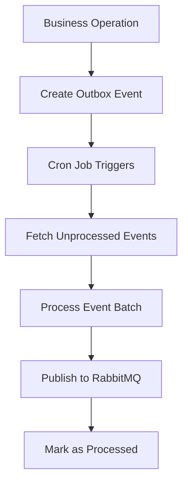

# Outbox Pattern Implementation

## Overview

The outbox pattern is implemented in the FUBS (see an example on sugarfoot app) to ensure reliable event publishing in a distributed microservices architecture. This pattern guarantees that business operations and event publishing happen atomically, preventing data inconsistencies.

## Current Architecture

### Core Components

1. **OutboxProcessorModule** (`/outbox-processor.module.ts`)

   - Configures scheduled processing with NestJS Schedule module
   - Sets up RabbitMQ client for message publishing
   - Integrates Prisma for database operations

2. **OutboxProcessorService** (`/outbox-processor.service.ts`)

   - Processes outbox events in batches
   - Handles cron-based event processing (configurable via `OUTBOX_CRON_EXPRESSION`)

3. **Database Schema** (Prisma-based)
   - `outbox` table with fields: `id`, `type`, `payload`, `processed`, `createdAt`, `processedAt`

### Current Flow



## Good Practices Implemented

### 1. **Transaction Safety**: Implement atomic transactions

**Risk**: Data inconsistency between business operations and event creation

Example with Prisma transaction (guarantees both operations succeed or fail together):

```typescript
await this.prisma.$transaction(async (tx) => {
  const workspace = await tx.workspace.create({ data });
  await tx.outbox.create({
    data: { type: Events.WORKSPACE_CREATED, payload: JSON.stringify(workspace) },
  });
});
```

## Missing Features / Risks

### 2. **Basic Retry Mechanism**

**Risk**: The current retry mechanism is basic and works, but it has several limitations as follows:

#### Infinite Retries

- Events are retried indefinitely until success

#### No Backoff Strategy

- Failed events are retried every 30 seconds (cron interval)
- No increasing delay between retries
- Can overwhelm external services with constant failed requests

#### No Retry Tracking

- No way to distinguish between new events and repeatedly failed events
- No visibility into retry count or failure patterns
- No way to identify permanently failed events

### 3. **No Idempotency Protection**

**Risk**: Duplicate event processing during service crashes

### 4. **Incomplete Error Handling**

**Risk**: Silent failures and lost events

- Structured error logging
- Error categorization
- Monitoring and alerting integration
