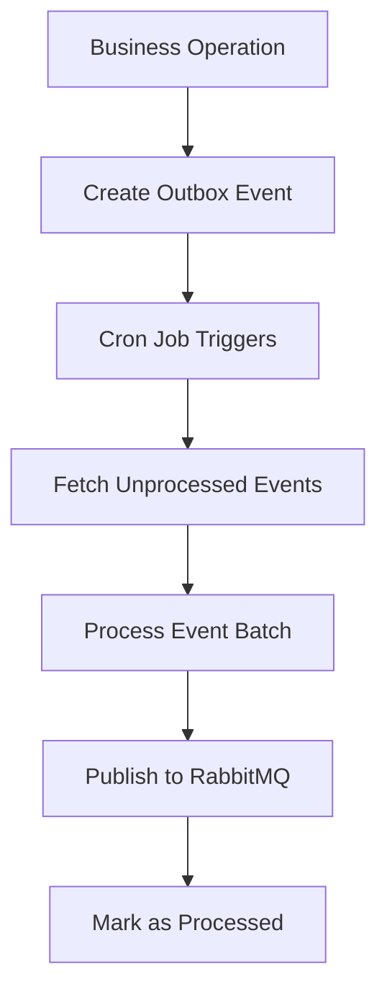
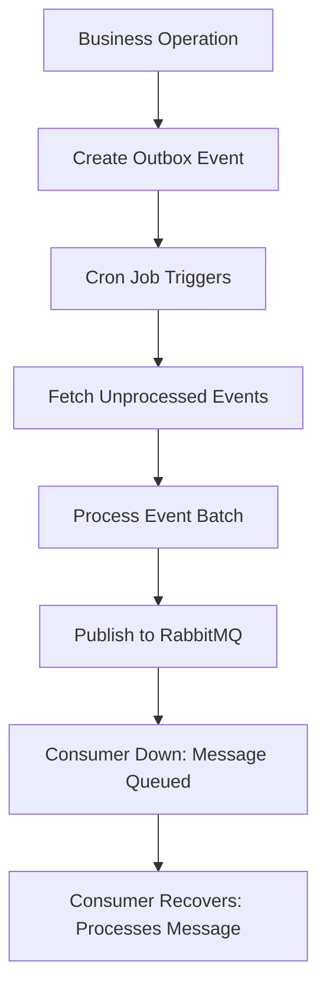

# Outbox Pattern Implementation

## Overview

The outbox pattern is implemented in the FUBS (see an example on sugarfoot app) to ensure reliable event publishing in a distributed microservices architecture. This pattern guarantees that business operations and event publishing happen atomically, preventing data inconsistencies.

## Current Architecture

### Core Components

1. **OutboxProcessorModule** (`/outbox-processor.module.ts`)

   - Configures scheduled processing with NestJS Schedule module
   - Sets up RabbitMQ client for message publishing
   - Integrates Prisma for database operations

2. **OutboxProcessorService** (`/outbox-processor.service.ts`)

   - Processes outbox events in batches
   - Handles cron-based event processing (configurable via `OUTBOX_CRON_EXPRESSION`)

3. **Database Schema** (Prisma-based)
   - `outbox` table with fields: `id`, `type`, `payload`, `processed`, `createdAt`, `processedAt`

### Current Flow



## Good Practices Implemented

### 1. **Transaction Safety**: Implement atomic transactions

**Risk**: Data inconsistency between business operations and event creation

Example with Prisma transaction (guarantees both operations succeed or fail together):

```typescript
await this.prisma.$transaction(async (tx) => {
  const workspace = await tx.workspace.create({ data });
  await tx.outbox.create({
    data: { type: Events.WORKSPACE_CREATED, payload: JSON.stringify(workspace) },
  });
});
```

## Missing Features / Risks

## What Happens if the Consumer is Out?

When the OutboxProcessorService publishes an event to RabbitMQ, it marks the event as processed in the database. If the consumer is unavailable (crashed, disconnected, or down), RabbitMQ will queue the message (if configured for durability), but the outbox will consider the event "done". There is no feedback loop to ensure the consumer has actually processed the event.

### Event Flow with Consumer Down



**Risks:**

- If RabbitMQ is not durable, messages may be lost if it restarts.
- If the consumer fails after receiving but before processing, you may have duplicate or lost processing unless the consumer is idempotent.
- No tracking of consumer acknowledgment in the outbox table—once published, the event is considered "done" from the producer's perspective.

### How to Improve Reliability

To ensure end-to-end delivery and processing, consider the following improvements:

- **Enable Durable Queues and Persistent Messages** in RabbitMQ to avoid message loss.

  _Example:_

  ```typescript
  app.connectMicroservice<MicroserviceOptions>({
    transport: Transport.RMQ,
    options: {
      urls: [process.env.RABBITMQ_URL as string],
      queue: process.env.RABBITMQ_QUEUE as string,
      queueOptions: {
        durable: true,
      },
      noAck: false,
      socketOptions: {
        heartbeatIntervalInSeconds: 60,
        reconnectTimeInSeconds: 5,
      },
    },
  });
  ```

- **Implement Dead-Letter Queues (DLQ):** Route failed messages to a DLQ for later inspection and reprocessing.
- **Consumer Acknowledgments:** Ensure consumers acknowledge message processing. Use manual acks and only remove from the queue after successful processing.

  _Example:_

  ```typescript
  // In NestJS microservice controller
  @EventPattern(Events.SUBSCRIPTION_CREATED)
  async handleSubscriptionCreated(
    @Payload() data: SubscriptionEventPayload,
    @Ctx() context: RmqContext
  ) {
    try {
      await this.subscriptionService.handleSubscriptionCreated(data);
      this.logger.log(`Subscription created: ${JSON.stringify(data)}`);

      const channel = context.getChannelRef();
      const originalMsg = context.getMessage();
      channel.ack(originalMsg);
    } catch (error) {
       this.logger.error(
        `Failed to process subscription created event: ${error}`
      );

      this.handleError(
        (error as any).status,
        context,
        Events.SUBSCRIPTION_CREATED
      );
    }
  }

  private handleError(
    errorStatus: number,
    context: RmqContext,
    eventType: string
  ): void {
    const channel = context.getChannelRef();
    const originalMsg = context.getMessage();

    const isServerError = errorStatus >= 500 && errorStatus < 600;

    if (isServerError) {
      this.logger.warn(
        `Server error (${errorStatus}) for ${eventType} - leaving message unacknowledged for retry on restart`
      );
      // Don't call nack() - let message remain unacknowledged
      return;
    }

    this.logger.error(
      `Client error (${errorStatus}) for ${eventType} - sending message to DLQ`
    );
    // For non-500 errors (client errors), nack and send to DLQ
    channel.nack(originalMsg, false, false);
  }


  ```

- **Idempotency on Consumer Side:** Make event handlers idempotent to safely handle duplicate deliveries.

  _Example:_

  ```typescript
  // Example: Check if event was already processed before acting
  async function processEvent(event: any) {
    const alreadyProcessed = await prisma.eventLog.findUnique({
      where: { eventId: event.id },
    });
    if (alreadyProcessed) return;
    // ...process event...
    await prisma.eventLog.create({ data: { eventId: event.id } });
  }
  ```

---

### 2. **Basic Retry Mechanism**

**Risk**: The current retry mechanism is basic and works, but it has several limitations as follows:

#### Infinite Retries

- Events are retried indefinitely until success

#### No Backoff Strategy

- Failed events are retried every 30 seconds (cron interval)
- No increasing delay between retries
- Can overwhelm external services with constant failed requests

#### No Retry Tracking

- No way to distinguish between new events and repeatedly failed events
- No visibility into retry count or failure patterns
- No way to identify permanently failed events

### 3. **No Idempotency Protection**

**Risk**: Duplicate event processing during service crashes

### 4. **Incomplete Error Handling**

**Risk**: Silent failures and lost events

- Structured error logging
- Error categorization
- Monitoring and alerting integration
